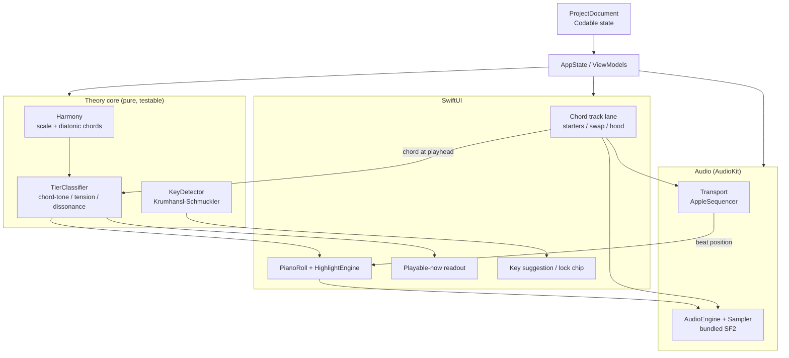

# feat: Harmonic Guidance Engine (native macOS, v1)

## Summary

Build the v1 Harmonic Guidance Engine for "in key" as a native macOS SwiftUI app:
a familiar piano roll whose notes re-tier in real time — solid chord tones, spicy-but-good
tensions, flagged dissonance — against a guided chord track the player builds, with
infer-and-lock key detection and a lighter cold-start mode before a chord track exists.
Because the repo is greenfield, this plan also stands up the foundation the engine
assumes: an Xcode document app, the AudioKit audio engine with transport/playhead, and
project save/load.

---

## Problem Frame

The target user (`STRATEGY.md`) is a player, not a producer: they can pick up a guitar or
bass and sing, but lack the theory to compose or arrange around what they played. Every
existing DAW's piano roll assumes that missing knowledge. The brainstorm
(`docs/brainstorms/2026-06-11-harmonic-guidance-engine-requirements.md`) reframed the
problem: the piano roll itself isn't the wall, the *unlabeled* piano roll is — and static
in-scale highlighting (which FL and Ableton already ship) is parity, not a product. The
bet is guidance that knows what sounds good *right now, given the chord that's playing*,
and labels dissonance as a deliberate choice rather than hiding it.

This plan is the load-bearing track of a brand-new product, so it carries two weights at
once: the guidance engine's novel logic, and the greenfield scaffolding that has to exist
for any of it to run.

---

## Requirements

Requirement IDs R1–R13 are carried verbatim from the origin brainstorm
(`see origin` for full text); R14–R16 are foundation requirements this plan adds because
the repo is empty.

**Key detection and locking** (origin R1–R4)

- R1. A new project starts with no key locked; the piano roll is usable immediately.
- R2. As notes are placed/played, the engine infers a likely key/scale and surfaces it as
  a low-confidence, dismissable suggestion that does not act on its own.
- R3. The player can accept a suggested key, set one directly, or override a locked key at
  any time.
- R4. Once a chord track exists, it is the authoritative source of key and harmonic
  context; note-based inference is the cold-start bridge (see R12).

**Guided chord track** (origin R5–R9)

- R5. A dedicated chord-track lane lets the player build a progression that plays back as
  an audible backing bed.
- R6. The default flow offers known-good progression starters to drop in, then swap any
  single chord for another suggested in-key chord and hear the difference.
- R7. Chord suggestions are in-key and ordered by what commonly sounds good next; the
  player auditions by ear before committing.
- R8. An "open the hood" mode lets the player free-build or alter any chord — including
  out-of-suggestion chords — with consonance feedback on what they stack.
- R9. Theory names are available but never required to build a progression.

**Context-aware piano-roll highlighting** (origin R10–R13)

- R10. As the playhead crosses each chord, the roll re-tiers every note relative to the
  chord sounding now: solid chord tones, spicy-but-good tensions, flagged dissonance.
- R11. Dissonant/off-tier notes stay fully playable and placeable; tiering is visual only
  and never disables a note.
- R12. Cold-start: before a chord track exists, the engine infers/locks the key and
  highlights at the scale level only, upgrading to full per-chord context once a
  progression is present.
- R13. The same tiering is surfaced as a live "notes you could play right now" readout
  reflecting the chord at the playhead.

**Foundation** (plan-added)

- R14. The app is a document-based macOS app: a project opens, edits, saves to a file, and
  reopens with chord track, notes, and key state intact.
- R15. A transport (play/stop, tempo, looping) drives a visual playhead synced to audio
  time without audio-thread/UI-thread coupling.
- R16. Chords and notes produce audible sound through a bundled instrument with no
  external setup by the user.

---

## Key Technical Decisions

Each decision is grounded in the native-stack research consolidated for this plan (see
**Sources & Research**).

- **Native macOS, Swift 5.5+ / SwiftUI, document-based app.** Chosen over browser/Tauri
  per explicit user direction. Targets macOS 12+ (AudioKit's floor). The document-based
  app pattern (`DocumentGroup`) gives autosave, Recent Documents, and version history for
  free.

- **AudioKit 5.7.x + AudioKitEX as the audio engine.** Mature, actively maintained (5.7.2,
  March 2026), and a thin layer over `AVAudioEngine` — Apple's own GarageBand/Logic use
  the same Core Audio substrate, so the architecture stays aligned with the platform and
  the future live-input track is additive, not a rewrite.

- **`AVAudioUnitSampler` + a bundled SF2 soundfont for synthesis.** Zero dependency beyond
  the OS, polyphonic by default, immediately musical. A redistributable General-MIDI
  soundfont (e.g., GeneralUser GS) ships in the app bundle. Fallback if SF2 stability bites:
  `DunneAudioKit.Sampler` (SFZ). Rationale: fastest path to "it makes sound" for a solo dev.

- **Tonic 2.0 for music theory primitives.** Provides `Note`/`Pitch`/`Chord`/`Key`/`Scale`
  with bit-set pitch-class membership (`noteSet`, `noteClasses`) for O(1) lookups, plus
  diatonic chords per key. It does **not** classify chord tones vs tensions vs avoid-notes,
  and has no sparse-note key finder — those are the engine's novel core and are hand-rolled
  on top of Tonic (see U3, U4).

- **Hand-rolled three-tier classifier.** Chord tones = chord's own pitch classes; tensions
  = scale pitches ≥2 semitones from every chord tone; dissonance/avoid = pitches a half
  step above a chord tone (and non-scale tones). ~25 lines over Tonic primitives. No
  library covers this in either Swift or JS — it is the product's differentiator.

- **Hand-rolled Krumhansl–Schmuckler key detection.** A 12-bin pitch-class histogram
  correlated (Pearson) against 24 key profiles; argmax with a confidence gap. Surface the
  top candidates as a suggestion only — never auto-lock below ~10–12 distinct notes, where
  the algorithm is unreliable. This is exactly why the UX is infer-*and-confirm* (R2).

- **AudioKit `PianoRoll` SwiftUI component as the roll base.** Editable, with a
  `noteContent` per-note view closure and `rowBackgroundColor` per-row closure — both are
  the hooks the tier coloring needs, so the component is used rather than fought. Flagged as
  replaceable if v-next needs velocity lanes or multi-track lanes it can't express.

- **Transport→playhead via polled beat position, not render-thread callbacks.** Drive the
  SwiftUI playhead from a `CADisplayLink`/timer on the main thread reading the sequencer's
  `currentPosition` (beats). Never mutate `@State` from the audio render thread. This is the
  single most common timing bug in this class of app.

- **`FileDocument` + `Codable` for project persistence — not SwiftData.** SwiftData
  document stores have confirmed corruption bugs through 2025/2026. A `Codable` project
  struct serialized to JSON via `FileDocument` is ~50 lines and safe.

- **Tier visual language: traffic-light semantics.** Solid = green/neutral-strong, tension
  = amber, dissonance = red/flagged. Maps to an intuition users decode fast; exact palette
  and accessibility (non-color cues for dissonance) deferred to implementation.

---

## High-Level Technical Design

Two things carry the design that prose alone blurs: the component topology (who owns what)
and the timing path (how audio and the visual playhead stay in sync without thread
coupling).

### Component topology



### Timing / sync path (the critical correctness concern)

```mermaid
sequenceDiagram
  participant Seq as AppleSequencer (audio time)
  participant Sampler as AVAudioUnitSampler
  participant Link as CADisplayLink (~60fps, main)
  participant State as @Published playheadBeat
  participant Roll as PianoRoll + HighlightEngine

  Seq->>Sampler: scheduled chord/note events (audio thread)
  loop every frame
    Link->>Seq: read currentPosition (beats) [main-thread safe]
    Link->>State: set playheadBeat
    State->>Roll: redraw playhead + recompute tiers for chord@beat
  end
  Note over Roll: tiers recomputed from chord under playhead,<br/>NOT from render-thread callbacks
```

Directional only — the prose in each unit is authoritative where they disagree.

---

## Output Structure

Greenfield layout (the per-unit **Files** lists are authoritative; this tree is the
expected shape):

```
InKey.xcodeproj
InKey/
  InKeyApp.swift                      # @main, DocumentGroup
  Project/
    ProjectDocument.swift             # FileDocument
    ProjectModel.swift                # Codable: ChordEvent, NoteEvent, KeyState, tempo
    AppState.swift                    # top-level observable state / wiring
  Audio/
    AudioEngine.swift                 # AudioKit engine + sampler bootstrap
    Instrument.swift                  # SF2 load via AVAudioUnitSampler
    Transport.swift                   # AppleSequencer wrapper, play/stop, position
  Theory/
    Harmony.swift                     # Tonic wrappers: scale membership, diatonic chords, starters
    TierClassifier.swift              # chord-tone / tension / dissonance
    KeyDetector.swift                 # Krumhansl-Schmuckler
  ChordTrack/
    ChordTrackModel.swift             # ordered chord events + chord-at-beat lookup
    ChordTrackView.swift              # guided building: starters + swap
    ChordEditorView.swift             # free-build "under the hood" + consonance feedback
    ChordPlayback.swift               # schedule chord bed into the sampler
  PianoRoll/
    PianoRollView.swift               # AudioKit PianoRoll integration + note playback
    HighlightEngine.swift             # tiering keyed to chord at playhead (+ cold-start)
    PlayableNowView.swift             # live "notes you could play now" readout
  KeyInference/
    KeyInferenceController.swift      # infer-and-lock UX glue
  Resources/
    GeneralUserGS.sf2                 # bundled soundfont
InKeyTests/
  HarmonyTests.swift
  TierClassifierTests.swift
  KeyDetectorTests.swift
  ChordTrackModelTests.swift
  HighlightEngineTests.swift
  ProjectPersistenceTests.swift
```

---

## Implementation Units

Grouped into five phases. Pure-logic units (Phase B) are deliberately sequenced early and
isolated from UI so the novel, highest-risk theory code is unit-tested before anything
depends on it.

### Phase A — Foundation

### U1. Project scaffolding, dependencies, and document model

- **Goal:** A buildable, document-based macOS app shell that opens/saves an (initially
  near-empty) project file.
- **Requirements:** R14
- **Dependencies:** none
- **Files:** `InKey.xcodeproj`, `InKey/InKeyApp.swift`, `InKey/Project/ProjectDocument.swift`,
  `InKey/Project/ProjectModel.swift`, `InKey/Project/AppState.swift`,
  `InKeyTests/ProjectPersistenceTests.swift` (initial round-trip only)
- **Approach:** Create a SwiftUI macOS app using `DocumentGroup(newDocument:)`. Add SPM
  dependencies: AudioKit, AudioKitEX, SoundpipeAudioKit (if needed), Tonic, and AudioKit
  `PianoRoll`. Define `ProjectModel` as a `Codable` struct (tempo, `[ChordEvent]`,
  `[NoteEvent]`, `KeyState`) and a `FileDocument` wrapper serializing JSON. Register a
  custom UTI for the project type in Info.plist. `AppState` is the top-level observable
  object the views and engine wire into.
- **Patterns to follow:** Apple "Building a Document-Based App with SwiftUI"; AudioKit
  Cookbook SPM setup.
- **Test scenarios:**
  - Covers R14. Round-trip: encode a `ProjectModel` with sample tempo/chords/notes/key,
    decode it, assert deep equality.
  - Empty/new project decodes to sensible defaults (no key locked, empty tracks, default
    tempo).
  - Forward-compat guard: decoding a project JSON missing a later-added optional field does
    not throw (use optional/`decodeIfPresent`).
- **Verification:** App launches to an empty project window; File ▸ Save writes a file that
  reopens with identical state; tests green.

### U2. Audio engine, instrument, and transport/playhead

- **Goal:** Sound comes out, and a transport drives a beat position the UI can read.
- **Requirements:** R15, R16
- **Dependencies:** U1
- **Files:** `InKey/Audio/AudioEngine.swift`, `InKey/Audio/Instrument.swift`,
  `InKey/Audio/Transport.swift`, `InKey/Resources/GeneralUserGS.sf2`
- **Approach:** Bootstrap the AudioKit engine; load the bundled SF2 into an
  `AVAudioUnitSampler` (`Instrument`). `Transport` wraps `AppleSequencer`: play/stop, tempo,
  loop region, and a main-thread-safe `currentPosition` (beats). Expose `playheadBeat` as a
  `@Published` value updated from a `CADisplayLink`/timer reading `currentPosition` — never
  from the render thread. Add a pre-roll/offset workaround for the known first-beat timing
  quirk.
- **Execution note:** Verify "it makes sound" with a throwaway play-a-note button before
  wiring sequencing — audio bootstrap failures are environmental and worth isolating early.
- **Patterns to follow:** AudioKit Cookbook (engine + sampler); the sample-time→beats
  pattern from the research sources.
- **Test scenarios:**
  - Beats↔seconds conversion is correct for representative tempos (e.g., 120 BPM → 0.5 s/beat).
  - Transport state machine: stopped→playing→stopped transitions report expected positions;
    loop wraps position at the loop boundary.
  - `Test expectation: none` for raw audio output itself (hardware/threaded) — covered by
    manual verification; logic around it (position math, state) is unit-tested above.
- **Verification:** Pressing play advances `playheadBeat` smoothly; a test note/chord is
  audible through the bundled instrument; no audio-thread/UI assertions fire.

### Phase B — Theory core (pure, testable)

### U3. Harmony wrapper and three-tier classifier

- **Goal:** Given a chord (and key), classify every pitch class as chord tone, tension, or
  dissonance — the engine's differentiator.
- **Requirements:** R10, R11
- **Dependencies:** U1 (types only; no UI/audio)
- **Files:** `InKey/Theory/Harmony.swift`, `InKey/Theory/TierClassifier.swift`,
  `InKeyTests/HarmonyTests.swift`, `InKeyTests/TierClassifierTests.swift`
- **Approach:** `Harmony` wraps Tonic for scale membership, diatonic chords of a key, and a
  curated set of progression starters (data for U6). `TierClassifier` is a pure function over
  Tonic `Chord`/`Key`/`Pitch`.
- **Technical design (directional, not spec):**
  ```
  enum Tier { case chordTone, tension, dissonance }
  func tier(pitchClass pc, chord, key?) -> Tier:
      if chord.noteClasses.contains(pc): return .chordTone
      let minSemis = min over chordTone t of semitoneDistance(pc, t)
      if minSemis == 1: return .dissonance          // half-step-above = avoid
      if key != nil && !key.noteSet.contains(pc): return .dissonance  // out-of-key
      return .tension                                // whole-step+ and in-key
  ```
- **Test scenarios:**
  - Covers R10. C major triad, no key: C/E/G → chordTone; D/A → tension; F (half-step above
    E) → dissonance.
  - Covers R10. Cmaj7 in C major: B → chordTone; D → tension; F → dissonance (♭9 over the 3rd).
  - Minor and dominant-7 chords classify their own chord tones correctly.
  - In-key filter: with key = C major, F# is dissonance even where interval math alone would
    call it a tension.
  - Every one of the 12 pitch classes resolves to exactly one tier for a given chord (total
    function, no gaps/overlaps).
  - Enharmonic equivalence: inputs spelled differently but same pitch class classify identically.
- **Verification:** Classifier tests green; `Harmony` returns the expected diatonic chord set
  for several keys.

### U4. Key detection (Krumhansl–Schmuckler)

- **Goal:** Infer ranked key candidates with confidence from a sparse set of placed notes.
- **Requirements:** R2, R4
- **Dependencies:** U1 (types only)
- **Files:** `InKey/Theory/KeyDetector.swift`, `InKeyTests/KeyDetectorTests.swift`
- **Approach:** Build a 12-bin pitch-class histogram (count- or duration-weighted), Pearson-
  correlate against 24 major/minor profiles, return ranked `(Key, score)` with a confidence
  gap between #1 and #2. Expose a `minNotesForConfidence` threshold (~10–12) below which the
  result is explicitly low-confidence.
- **Test scenarios:**
  - A full C-major scale histogram ranks C major #1.
  - An unambiguous A-minor melodic fragment ranks A minor above C major.
  - Sparse input (3–4 notes) returns low-confidence / small gap — assert the confidence flag
    is false, proving the engine won't auto-lock (supports R2's "suggestion only").
  - Empty input returns no candidate rather than a garbage argmax.
  - Adding one note can flip the top candidate when notes are few — assert this is reported as
    low-confidence, not silently confident.
- **Verification:** Detector tests green, including the explicit sparse-input low-confidence
  guarantee.

### Phase C — Chord track

### U5. Chord-track model and backing-bed playback

- **Goal:** An ordered chord progression that both answers "what chord is at beat T" and
  plays back as audible backing.
- **Requirements:** R5, R4
- **Dependencies:** U2, U3
- **Files:** `InKey/ChordTrack/ChordTrackModel.swift`, `InKey/ChordTrack/ChordPlayback.swift`,
  `InKeyTests/ChordTrackModelTests.swift`
- **Approach:** `ChordTrackModel` stores ordered `ChordEvent`s (chord, start beat, length)
  with a `chord(atBeat:)` lookup — the function the highlight engine and tier classifier
  consume. `ChordPlayback` schedules each chord's notes into the sampler via the sequencer as
  a simple sustained bed. Voicing kept simple (root-position triad/7th) for v1.
- **Test scenarios:**
  - Covers R10/R12 boundary. `chord(atBeat:)` returns the correct chord across boundaries,
    including exact boundary beats (define and test half-open interval behavior).
  - Empty track: `chord(atBeat:)` returns nil everywhere (drives cold-start, R12).
  - Overlap/gap handling: define behavior for gaps (nil) and assert it.
  - Reordering/removing a chord updates lookups correctly.
- **Verification:** Lookup tests green; pressing play produces an audible chord bed that
  matches the placed progression.

### U6. Guided chord building — starters and swap

- **Goal:** A no-theory player assembles a good-sounding progression fast.
- **Requirements:** R6, R7, R9
- **Dependencies:** U5
- **Files:** `InKey/ChordTrack/ChordTrackView.swift`
- **Approach:** Present progression starters (curated, from `Harmony`). Selecting a chord
  offers in-key swap suggestions ordered by common-next likelihood; each is auditionable
  before commit. Chord/theory names are shown but optional (R9). Writes through to
  `ChordTrackModel`.
- **Test scenarios:**
  - Covers R6. Suggested swaps for a given chord/key are all in-key (assert against `Harmony`).
  - Covers R7. Suggestion ordering is deterministic for a fixed key/context (snapshot the
    ranked list).
  - Auditioning a chord does not mutate the committed progression; committing does.
  - Covers R9. The progression can be built end-to-end without any theory-name interaction
    (logic path exercised without name fields).
- **Verification:** A starter can be dropped in and a chord swapped, with audible difference,
  in a few clicks; suggestions are always in-key.

### U7. Free-build "under the hood" with consonance feedback

- **Goal:** Let the player build/alter any chord, including deliberately weird ones.
- **Requirements:** R8
- **Dependencies:** U6, U3
- **Files:** `InKey/ChordTrack/ChordEditorView.swift`
- **Approach:** An expandable editor to add/remove notes of a chord freely. As notes are
  stacked, reuse `TierClassifier`/interval logic to show consonant vs spicy vs harsh
  feedback. Out-of-suggestion chords are allowed and write back to `ChordTrackModel`; the
  resulting chord still drives downstream highlighting.
- **Test scenarios:**
  - Covers R8. A hand-built non-diatonic chord persists to the model and is returned by
    `chord(atBeat:)`.
  - Consonance feedback for a stacked interval matches the classifier (e.g., a minor-2nd
    stack reads as harsh).
  - A custom chord drives the piano-roll tiering downstream (integration with U9) — placing a
    note against it tiers relative to the custom chord, not a diatonic guess.
- **Verification:** Building a deliberately dissonant chord works, is labeled, plays, and
  re-tiers the roll beneath it.

### Phase D — Piano roll and guidance

### U8. Piano roll integration and note playback

- **Goal:** An editable piano roll where placed notes play and align to the transport.
- **Requirements:** R1, R11
- **Dependencies:** U2
- **Files:** `InKey/PianoRoll/PianoRollView.swift`
- **Approach:** Integrate AudioKit `PianoRoll` bound to the project's `[NoteEvent]`. Map the
  component's abstract pitch axis to MIDI note numbers. Notes are placeable/draggable and
  audition through the sampler. Roll is usable with no key and no chord track (R1).
- **Test scenarios:**
  - Covers R1. With no key and no chord track, notes can be placed and play (no precondition
    blocks editing).
  - NoteEvent↔PianoRoll model mapping round-trips (pitch/start/length) without drift.
  - Covers R11. Placing a note that will later be flagged dissonant still succeeds — placement
    is never gated on tier.
- **Verification:** Notes can be drawn, moved, and heard; they persist into the project model.

### U9. Context-aware highlight engine, cold-start, and playable-now readout

- **Goal:** The marquee behavior — the roll re-tiers live against the chord under the
  playhead, degrading gracefully when there's no chord track.
- **Requirements:** R10, R11, R12, R13
- **Dependencies:** U3, U5, U8, U2
- **Files:** `InKey/PianoRoll/HighlightEngine.swift`, `InKey/PianoRoll/PlayableNowView.swift`
- **Approach:** `HighlightEngine` computes, for the chord at `playheadBeat` (from
  `ChordTrackModel.chord(atBeat:)`), a per-pitch tier via `TierClassifier`, and feeds the
  `PianoRoll` `noteContent`/`rowBackgroundColor` closures plus the `PlayableNowView`. Cold-
  start (R12): when `chord(atBeat:)` is nil, fall back to scale-level highlighting from the
  locked/inferred key, or neutral if no key yet. Recompute on playhead movement and on chord-
  track edits. Keep recomputation cheap (precompute the 12-pitch-class tier map per chord;
  notes look up by pitch class).
- **Technical design (directional):**
  ```
  tierMap(forBeat b):
    if let chord = chordTrack.chord(atBeat: b):
        return [pc -> classifier.tier(pc, chord, key)]      // full context
    else if let key = currentKey:
        return [pc -> key.contains(pc) ? .chordTone : .dissonance]  // scale-level cold-start
    else:
        return neutral                                       // no key yet
  ```
- **Test scenarios:**
  - Covers R10. As `playheadBeat` crosses a chord boundary, the tier map for a fixed pitch
    changes to match the new chord.
  - Covers R12. Nil chord + locked key → scale-level tiers; nil chord + no key → neutral;
    presence of a chord → full per-chord tiers (three-state transition asserted).
  - Covers R11. A dissonant-tiered note remains present and playable; tier never removes it.
  - Covers R13. The playable-now readout reflects the same tier map as the roll for the chord
    at the playhead (single source of truth — assert they agree).
  - Editing the chord under the playhead recomputes tiers without moving the playhead.
  - Performance: recompute for a chord boundary touches at most 12 pitch-class computations,
    not per-note-per-frame recomputation (assert the precompute path is used).
- **Verification:** Playing over a progression visibly re-tiers the roll per chord; the
  readout matches; with the chord track emptied, the roll falls back to scale-level/neutral.

### U10. Key infer-and-lock UX

- **Goal:** Wire detection into a quiet, dismissable, overridable suggestion.
- **Requirements:** R2, R3, R4, R12
- **Dependencies:** U4, U8, U9
- **Files:** `InKey/KeyInference/KeyInferenceController.swift`
- **Approach:** On note edits (debounced), run `KeyDetector` over placed notes. When
  confidence clears the threshold, surface a dismissable "looks like X — lock it?" chip; do
  nothing on its own (R2). Accepting locks the key (feeds cold-start highlighting); the player
  can set/override anytime (R3). Once a chord track exists, the chord track is authoritative
  for key/context and inference recedes to the cold-start role (R4/R12).
- **Test scenarios:**
  - Covers R2. Below-threshold detection surfaces no suggestion (or an explicitly low-key one
    that does not change highlighting).
  - Covers R2/R3. Above-threshold surfaces a suggestion; ignoring it leaves highlighting
    unchanged; accepting locks the key and updates cold-start tiers.
  - Covers R3. Manual override replaces an inferred or locked key.
  - Covers R4. With a chord track present, key/context come from the chord track even if note-
    inference would suggest otherwise.
- **Verification:** Placing notes eventually offers a key suggestion that is easy to ignore and
  easy to accept; overriding works; chord track wins when present.

### Phase E — Persistence

### U11. Project save/load wiring

- **Goal:** Everything the player built survives close/reopen.
- **Requirements:** R14, R5
- **Dependencies:** U5, U8, U10
- **Files:** `InKey/Project/ProjectModel.swift` (extend), `InKey/Project/ProjectDocument.swift`
  (extend), `InKeyTests/ProjectPersistenceTests.swift` (extend)
- **Approach:** Ensure `ProjectModel` captures tempo, chord track, notes, and key state
  (locked vs inferred). Confirm the `FileDocument` round-trip preserves all of it. Version the
  schema with a format field for forward migration.
- **Test scenarios:**
  - Covers R14. Full-state round-trip (tempo + chords + notes + locked key) is deep-equal after
    encode/decode.
  - Locked-key vs no-key-yet both persist and restore correctly (no-key restores to cold-start,
    not a phantom key).
  - Schema-version field present; decoding a prior-version fixture without a later field
    succeeds.
- **Verification:** Build a small song, save, quit, reopen — chord track, notes, key, and tempo
  are intact and the roll tiers identically.

---

## Scope Boundaries

### Deferred for later (designed-for, not built in v1) — carried from origin

- Active suggestions (auto-generated melodies, "what chord comes next" generation). The data
  model must not preclude layering these on.
- Guitar/bass chord **detection** from recorded audio. When added, it feeds the same
  `ChordTrackModel` (U5) so detected chords land in a correctable structure rather than driving
  highlights directly.

### Outside this product's identity — carried from origin

- Replacing the piano roll with a non-piano-roll input paradigm. The decision is to augment the
  familiar roll.
- Blocking or auto-correcting "wrong" notes. The product labels dissonance; it never enforces
  consonance.

### Deferred to follow-up work (plan-local)

- Live audio-interface recording of guitar/bass/vocals (the separate `Audio Capture` strategy
  track). The stack choice (AudioKit over AVAudioEngine) keeps this additive.
- Multi-track piano-roll lanes, velocity editing, and mixing — beyond AudioKit `PianoRoll`'s v1
  surface; revisit the component choice then.
- Accessibility pass on tier color (non-color cues for dissonance) beyond a baseline.

---

## Risks & Dependencies

- **AudioKit `PianoRoll` ceiling.** Its abstract `Int` pitch axis and modest activity mean v-next
  needs (velocity lanes, multi-track) may force extending or replacing it. Mitigation: keep
  `NoteEvent`↔component mapping (U8) behind a thin boundary so the roll can be swapped.
- **`AVAudioUnitSampler` SF2 fragility.** Malformed presets can crash with no recovery.
  Mitigation: ship a single known-good, redistributable SF2; verify on launch; fallback path is
  `DunneAudioKit.Sampler` (SFZ).
- **Sparse-input key detection unreliability.** Inherent to K-S with few notes. Mitigation is the
  product design itself: suggestion-only, never auto-lock below threshold (U4/U10).
- **Audio-thread / UI-thread coupling.** The classic failure mode. Mitigation: playhead is polled
  from the main thread (U2); no `@State` mutation from the render thread — called out in U2/U9.
- **First-beat timing offset** in `AppleSequencer` (known quirk). Mitigation: pre-roll/offset in U2.
- **Soundfont licensing.** Bundling an SF2 requires a redistributable license (e.g., GeneralUser
  GS). Confirm license terms before shipping.
- **Dependency on Xcode/macOS toolchain** for build/run (Xcode MCP tooling is available in this
  environment).

---

## Open Questions

### Deferred to implementation

- Exact tier palette and the non-color dissonance cue (border/icon/pattern) for accessibility.
- Chord voicing strategy for suggestions and the backing bed (inversion/register) beyond simple
  root-position v1.
- Layout of the playable-now readout relative to the roll (panel vs inline strip).
- Whether the key-detection histogram weights by note duration or count (start with count; revisit
  if suggestions feel off).
- Debounce timing for key inference on note edits.

---

## Sources & Research

- Origin brainstorm: `docs/brainstorms/2026-06-11-harmonic-guidance-engine-requirements.md`.
- Product strategy: `STRATEGY.md` (player persona; "surface the harmonic landscape" approach;
  Harmonic Guidance Engine as the load-bearing track).
- AudioKit ecosystem (5.7.2, March 2026): https://github.com/AudioKit/AudioKit;
  Cookbook: https://github.com/AudioKit/Cookbook
- Tonic 2.0 (music theory primitives; `noteSet`/`noteClasses`, diatonic chords; no tier/avoid
  classifier): https://github.com/AudioKit/Tonic
- AudioKit `PianoRoll` (editable; `noteContent` + `rowBackgroundColor` closures for tier coloring):
  https://github.com/AudioKit/PianoRoll
- Synthesis: `AVAudioUnitSampler` + SF2 (recommended), `DunneAudioKit.Sampler` (SFZ) fallback:
  https://github.com/AudioKit/DunneAudioKit
- Transport/playhead sample-time→beats pattern:
  https://gmcerveny.medium.com/calculating-song-position-in-music-apps-with-swift-and-avaudioengine-75d05a3922d8
- Krumhansl–Schmuckler key finding (weight profiles, Pearson correlation; sparse-input caveats):
  http://rnhart.net/articles/key-finding/
- Persistence via `FileDocument` + `Codable` (SwiftData document-store corruption avoided):
  https://developer.apple.com/documentation/swiftui/building-a-document-based-app-with-swiftui
- Three-tier theory: available tensions (https://www.thejazzpianosite.com/jazz-piano-lessons/jazz-chords/available-tensions/)
  and avoid notes (https://en.wikipedia.org/wiki/Avoid_note).
